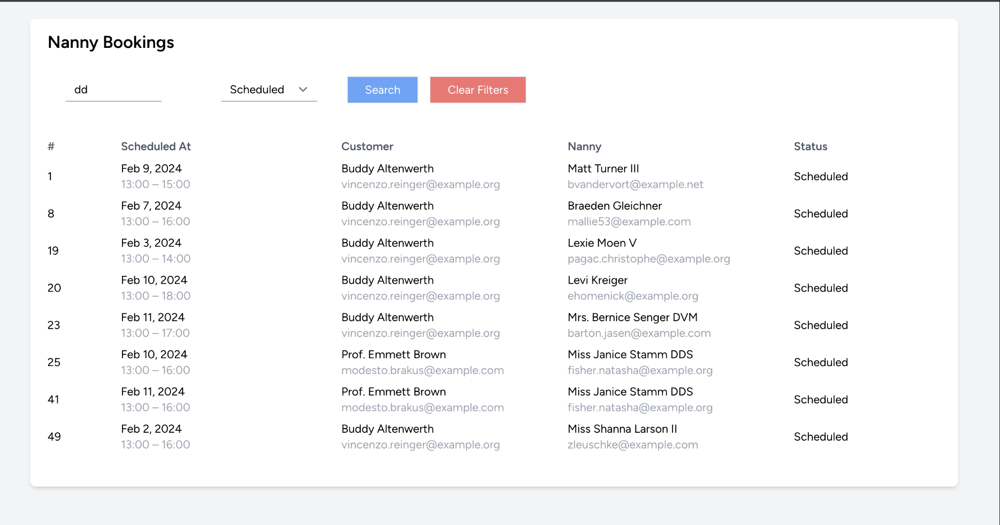

# Laravel-Inertia-Vue test assignment

## Assignment

1. Install the Laravel framework and commit that to a private Github repository as first commit.
2. Install Inertia.js & Vue.js into the project and commit that. This will be your baseline.
3. Create a new model in your application called NannyBooking. Create a table with a few simple
   attributes. You can choose the attributes yourself, but NannyBookings should be able to be linked to a user via a belongs-to relationship. Other attribute ideas could be a title, a price and a start/end date and time. You can create a seeder to seed 10 or 20 nanny bookings, for 5-10 users.
4. Create a controller with an appropriate name and return a Vue/Inertia page from the controller.
5. Take all the nanny bookings (no need for pagination) and pass them as a property to the Inertia.js.

Build a quick table in Vue that displays the nanny bookings including the attributes you created in a list. Also, make sure to include the associated user name/email in the table.

You now have a page in your application created with Vue and Inertia that shows a list of all the nanny bookings in your database and the users associated with them.
Challenge (~2-3 hours)

Let's assume we want to filter through the nanny bookings based on the attributes of the nanny bookings and based on the User relationship. Implement a way of filtering the nanny bookings and make sure that the component can be easily put on other index pages without much effort. How would you do this? Tip: reusability and clean code is very important. Good luck!

## Solution 

1. Implemented a basic responsive layout for the bookings.
2. Implemented a server-side search. The component is reusable as is.
3. Booking statuses account only for the positive flow. I imagine there would be other statuses in real-world scenarios.

Thank you,
Gregory.
